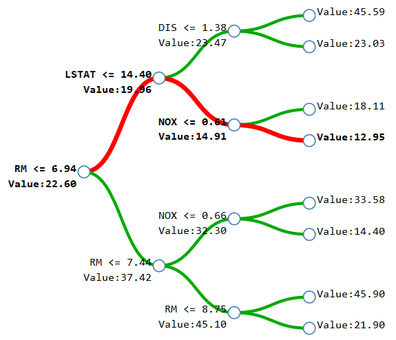

# explainableAI_varImpact

We have witnessed a lot of focus on *explainable AI* and *explainable machine learning* in recent years. There is a clear consensus that high performing black-box models require human-interpretable explanations to grow end-user trust and improve transparency.
Tree-based machine learning models are used in many domains where interpretability is important.
At the very least, interpretability means that we can understand
how the model uses input features to make predictions. 
In addition to the the long history of global interpretation methods for trees, a lot of attention has been paid recently on local explanations, which reveal the impact of input features on individual predictions.
Both global and local explanations can facilitate human–AI interactions, assist
model development, debugging and monitoring and imporve transparency.
Tree ensembles such as Random Forests are popular nonlinear
predictive models and often outperform competing methods such as neural networks. 
However, it has long been known that Mean Decrease Impurity (MDI), the default measures of feature importance in most software implementations, can show strong, systematic bias in feature selection.
